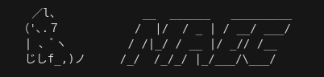

# maec

Modular Audio Engine in C++

## Disclaimer

This project is a work in progress!
This project will remain in an experimental state for a long time.
Any components or features may change in a massive way with no warning.
Use at your own risk.

## Theory

In theory, this project will provide modules that can be chained
together to produce/ work with audio data.
This can be anything ranging from generating audio data from scratch
to playing back audio data.

This project takes a lot of inspiration from modular analog synthesizers,
which provided a very simple yet powerful way to work with audio data.

When completed, this project will contain modules for generating/playing back audio data,
altering audio data (filters and whatnot), and outputting this data to multiple sources and backends.
This project is geared towards realtime audio playback and analysis.

## Current Features

We currently have a lot of things implemented!
As of now, most of this stuff is simply framework oriented,
but as time goes on we will be shifting focus more and more onto the process
of signal processing and audio synthesis.

Here are some of our features:

- A module framework!
    - Fully polymorphic! It is trivial to create and integrate your modules into MAEC
    - Modules can be linked and interact with each other
    - A complete state chain, describing how the state of each module changes,
        while allowing developers to hook custom actions into each state
    - 
- Home grown DSP algorithms!
    - Various convolution implementations
    - DFT and inverse DFT
    - Hooks into more common, better algorithms created by others
- A custom buffer for holding multi-channel signals!
    - Custom iterators for accessing this data in a standardized way(also works with STD methods that work with iterators!)
    - Provides different representations of multi-channel audio
    - Tools for "squishing" data into something more workable
- 