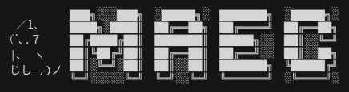

# maec

Modular Audio Engine in C++

## Disclaimer

This project is a work in progress!
This project will remain in an experimental state for a long time.
Any components or features may change in a massive way with no warning.
Use at your own risk.

## Theory

In theory, this project will provide modules that can be chained
together to produce/ work with audio data.
This can be anything ranging from generating audio data from scratch
to playing back audio data.

This project takes a lot of inspiration from modular analog synthesizers,
which provided a very simple yet powerful way to work with audio data.

When completed, this project will contain modules for generating/playing back audio data,
altering audio data (filters and whatnot), and outputting this data to multiple sources and backends.
This project is geared towards realtime audio playback and analysis.

Ideally, this project will be used as a framework for working with sound programably,
as well as providing an environment for creating and using digital instruments and voices!

In short, with the power of MAEC, you can:

- Create audio data from scratch!
- Alter existing audio data!
- Link discreet modules together to form a meaningful chain!
- Use our home grown DSP functions! (Ok maybe don't do this one...)
- Import and export audio data to various places/services!
- Hook your own custom functionality into MAEC!
- Impress your friends!

## Current Features

We currently have a lot of things implemented!
As of now, most of this stuff is simply framework oriented,
but as time goes on we will be shifting focus more and more onto the process
of signal processing and audio synthesis.

Here are some of our features:

- A module framework!
    - Fully polymorphic! It is trivial to create and integrate your custom modules into MAEC
    - Modules can be linked and interact with each other (forming a module chain)
    - A complete state chain, describing how the state of each module changes,
        while allowing developers to hook custom actions into each state
    - Module chains share a collection of information
    - Modules expose parameters which define how it operates. These parameters can be constant values,
        or can have modules attached to them for value modulation
    - Custom timekeeping done in relation to the chain, allowing modules to have an 
        understanding of time independent of 'wall' time.
- Sources and Sinks:
    - Sinks allow for audio data to leave the module chain
        - Output to ALSA devices
- Home grown DSP algorithms!
    - Various convolution implementations
    - DFT and inverse DFT
    - Radix2 Cooley-Turkey FFT (in place and out of place)
    - Methods and processing for FFT operations on real data
    - Fast convolution via FFT
    - Filter kernel generation
    - Implementations for recursive digital filters
    - Hooks into more common, better algorithms created by others
- A custom buffer for holding multi-channel signals!
    - Custom iterators for accessing this data in a standardized way(also works with STD methods that utilize iterators!)
    - Provides different representations of multi-channel audio
    - Tools for "squishing" data into something more workable
- Useful modules included!
    - Various meta modules for testing, profiling, and simplifying your experience
        (LatencyModule, Counter, UniformBuffer)
    - Fundamental oscillators (Sine, Square, Saw, Triangle)
    - Envelopes of all sorts (SetValue, Linear, Exponential, Chain, ADSR)
    - Module mixers allow for n:1, 1:n, and n:n relationships
